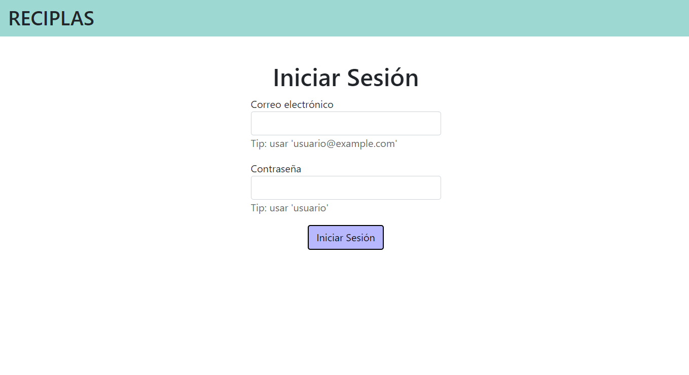
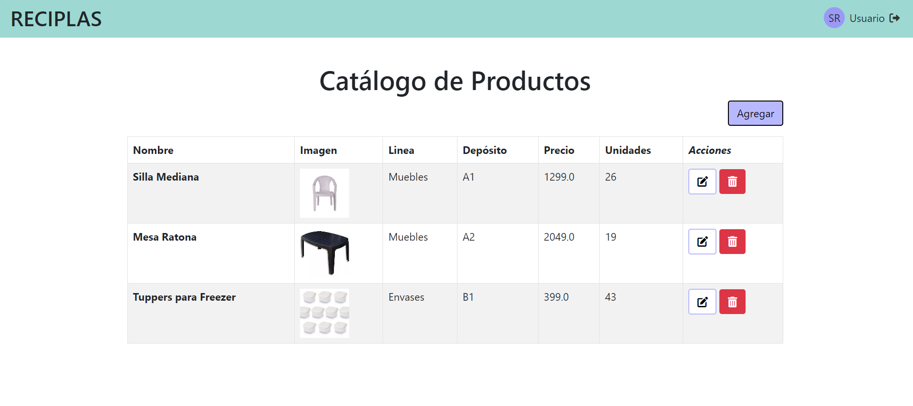
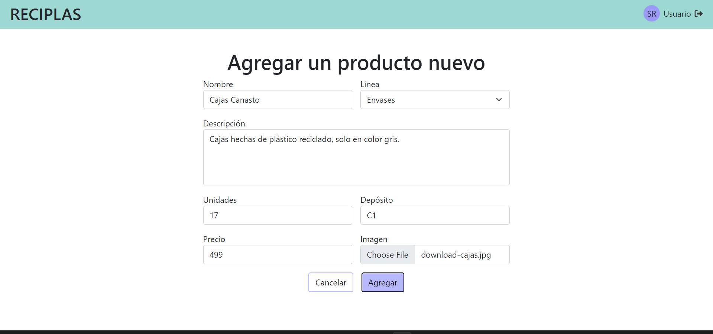

# Demo de la Realización de Caso de Uso 'Asignar Producto a Catálogo'

Esta demo desarrollada en Java permite al secretario agregar, modificar y eliminar productos del catálogo de Reciplas.

Se usó el framework Spring Boot con Maven como herramienta de build y Thymeleaf para las plantillas HTML, con la
intención de que el diagrama de secuencia de esta implementación sea lo más similar posible al diagrama de secuencia de
la realización de caso de uso diseño.

## Levantar el servidor en local

Es necesaria una base de datos MySQL.

1. A nivel root del proyecto (a la par del `pom.xml`), se debe crear un archivo `.env` con las siguientes variables de
   entorno:

```
DATABASE_NAME=dds-reciplas
DATABASE_HOST=localhost
DATABASE_USER=root
DATABASE_PASSWORD=root
```

2. Para levantar el servidor en `http://localhost:8080/` es preferible utilizar un IDE como **IntelliJ**, por su
   facilidad de uso. Si se desea hacerlo por línea de comandos, lo que requiere tener **Maven** instalado, se puede
   ejecutar el
   comando:

```
mvn spring-boot:run
```

En el puerto `8080` se debería ver la siguiente página:



## Funcionalidades

Luego de iniciar sesión como un empleado de administración, la aplicación nos muestra el catálogo de productos:



Y si seleccionamos agregar un producto nuevo, podemos ingresar sus datos en el siguiente formulario:

