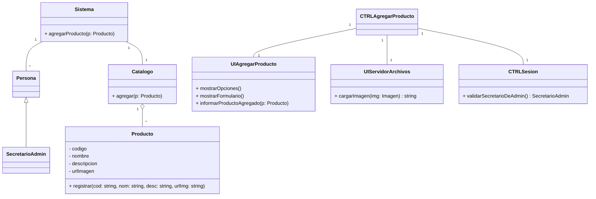
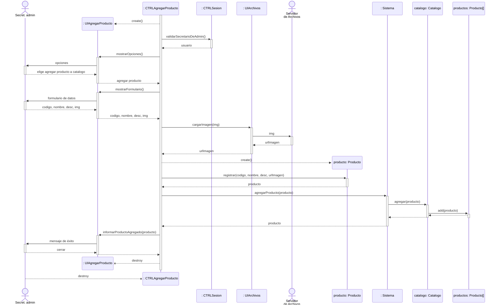

# Realización del Caso de Uso: Agregar Producto al Catálogo

## Caso de uso 
Creado por los alumnos de Análisis de Sistemas.

| Nombre | Agregar producto al catálogo. |
| -- | -- |
| Actor | Secretario de administración. |
| Precondiciones | Secretario de administración autenticado y con permisos para gestionar el catálogo de productos. |
|Descripción| El Secretario de administración agrega producto al catálogo para que  puedan ser visualizados por el cliente a través de la página web.|
|Postcondiciones| Nuevo producto agregado al catálogo.|

Acciones:
1. El Secretario de administración selecciona agregar producto al catálogo.
2. El Secretario de Administración introduce el código del producto.
3. El sistema confirma la existencia en la base de datos y muestra perfil del producto.
4. El sistema despliega un formulario de datos.
5. El Secretario de administración rellena el formulario de datos del producto: nombre, código del producto, descripción.
6. El Secretario de administración selecciona cargar imagen.
7. El sistema abre el explorador de archivos.
8. El Secretario de administración selecciona la imagen.
9. El sistema carga la imagen.
10. El Secretario de administración selecciona guardar datos.
11. El sistema emite un mensaje de "guardado exitoso".
12. Fin del caso de uso.

Casos alternativos:
- 3.a. Cliente no está registrado en la base de datos
- 6.a. El Secretario de administración desea no cargar imagen.
- 9.a. El sistema no carga imagen por incompatibilidad de formato o tamaño.
- 10.a. El Secretario de administración selecciona cancelar.
- 11.a. El sistema muestra un mensaje de “No se guardó con éxito”.

## Reformulación del Caso de Uso
Reformulado por nuestro equipo.

| Nombre | Agregar producto al catálogo. |
| -- | -- |
| Actor | Secretario de administración. |
| Precondiciones | Secretario de administración autenticado. |
| Descripción | El Secretario de administración agrega un producto al catálogo para que pueda ser visualizado por los clientes a través del sitio web. |
| Postcondiciones | Nuevo producto agregado al catálogo. |

Acciones:
1. El Secretario de administración selecciona agregar un producto nuevo al catálogo.
2. El sistema despliega un formulario de datos.
3. El Secretario de administración rellena el formulario de datos del producto: nombre, código del producto, descripción, imágen.
4. El Secretario de administración selecciona guardar el producto nuevo.
5. El sistema guarda la imagen del producto en un servidor de archivos.
6. El sistema registra el producto nuevo.
7. El sistema informa que el producto se registró exitosamente.
8. Fin del caso de uso.

Casos alternativos:
- 3.a. El sistema no carga imagen por incompatibilidad de formato o tamaño.
- - 3.a.1. El sistema informa que el formato o tamaño es erróneo, y lista los formatos aceptables junto al tamaño máximo.
- - 3.a.2. Volver al paso 3.
- 4.a. El Secretario de administración no cargó una imagen.
- - 4.a.1. Saltar al paso 6.
- 4.b. El Secretario de administración selecciona cancelar.
- - 4.b.1. El sistema retrocede a la vista anterior.
- - 4.b.2. Fin del caso de uso.
- 5.a. El servidor de archivos no logra guardar la imagen.
- - 5.a.1. El sistema registra el producto nuevo pero sin imágen.
- - 5.a.2. Saltar al paso 7.

## Tarjetas CRC

| Sistema | Contiene al resto de clases y las hace interactuar entre ellas para proveer funcionalidades. |
| -- | -- |
| Responsabilidades | Conocer a las personas. Conocer al catálogo de productos. Permitir agregar productos al catálogo. |
| Colaboraciones | Persona. Catálogo. Producto. |

| Persona | Representa a una persona con algún rol relevante para el sistema. |
| -- | -- |
| Responsabilidades | Gestionar los roles de diferentes personas. Almacenar la información de la persona. |
| Colaboraciones | Sistema. |

| SecretarioAdmin | Representa a una persona que gestiona el catálogo de productos. |
| -- | -- |
| Responsabilidades | Almacenar información de los secretarios de administración. Conocer al catálogo de la página web. Conocer a los productos del catálogo. |
| Colaboraciones | Sistema. Persona. |

| Catálogo | Representa el conjunto de productos que el sistema muestra para que los clientes compren. |
| -- | -- |
| Responsabilidades | Conocer al listado de productos del sistema. |
| Colaboraciones | Producto. |

| Producto | Representa un producto manufacturado por la empresa a partir de materia prima reciclada y vendido a clientes. |
| -- | -- |
| Responsabilidades | Almacenar la información del producto. |
| Colaboraciones | Catálogo. |

| CTRLAgregarProducto | Realiza las acciones necesarias para agregar un producto al catálogo. |
| -- | -- |
| Responsabilidades | Crear la UI. Enviar mensajes al sistema sobre las acciones del actor. Recibir resultados del sistema y enviárselos a la UI. |
| Colaboraciones | UIAgregarProducto. Sistema. CTRLSesion. UIServidorArchivos. |

| UIAgregarProducto | Posibilita la interacción entre el actor y el sistema para permitir agregar productos al catálogo. |
| -- | -- |
| Responsabilidades | Recibir del actor los datos del producto a agregar. Enviar al actor los resultados de su acción. |
| Colaboraciones | CTRLAgregarProducto. |

| CTRLSesion | Realiza las acciones necesarias para identificar la sesión del usuario actual. |
| -- | -- |
| Responsabilidades | Identificar al usuario autenticado. |
| Colaboraciones | CTRLAgregarProducto. |

| UIServidorArchivos | Permite interactuar con el servidor externo de archivos, que se usa para almacenar imágenes. |
| -- | -- |
| Responsabilidades | Enviar imágenes al servidor externo. Recibir del servidor externo las urls generadas para las imágenes guardadas. |
| Colaboraciones | CTRLAgregarProducto. |

## Diagrama de Clases

## Diagrama de Secuencia

