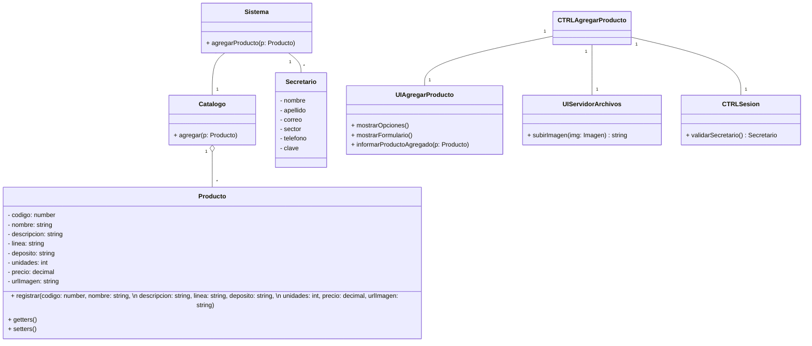
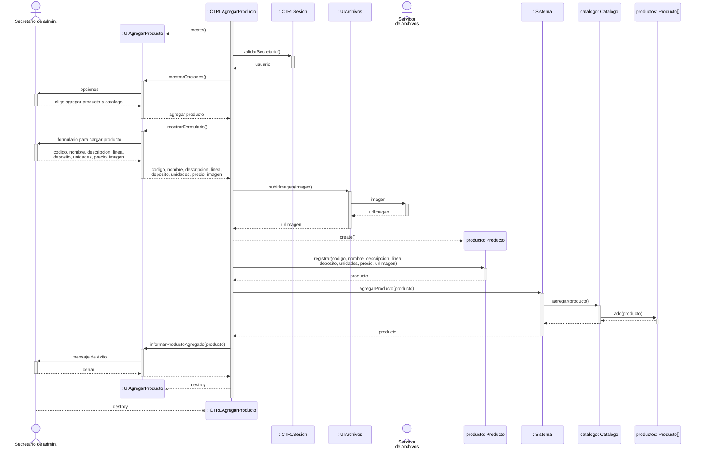
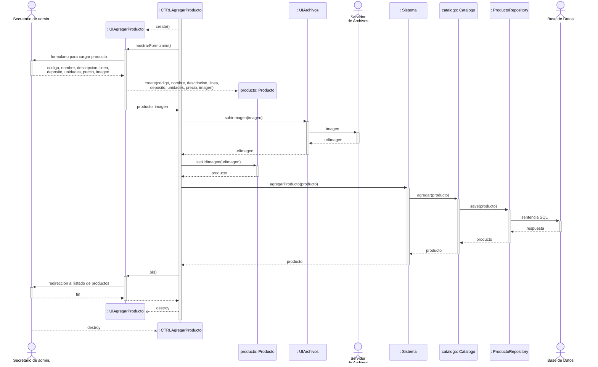

# Realización del Caso de Uso: Agregar Producto al Catálogo

## Caso de uso

Creado por los alumnos de Análisis de Sistemas. Lo citamos a modo de consigna.

| Nombre          | Agregar producto al catálogo.                                                                                                          |
| --------------- | -------------------------------------------------------------------------------------------------------------------------------------- |
| Actor           | Secretario de administración.                                                                                                          |
| Precondiciones  | Secretario de administración autenticado y con permisos para gestionar el catálogo de productos.                                       |
| Descripción     | El Secretario de administración agrega producto al catálogo para que puedan ser visualizados por el cliente a través de la página web. |
| Postcondiciones | Nuevo producto agregado al catálogo.                                                                                                   |

Acciones:

1. El Secretario de administración selecciona agregar producto al catálogo.
2. El Secretario de Administración introduce el código del producto.
3. El sistema confirma la existencia en la base de datos y muestra perfil del producto.
4. El sistema despliega un formulario de datos.
5. El Secretario de administración rellena el formulario de datos del producto: nombre, código del producto, descripción.
6. El Secretario de administración selecciona cargar imagen.
7. El sistema abre el explorador de archivos.
8. El Secretario de administración selecciona la imagen.
9. El sistema carga la imagen.
10. El Secretario de administración selecciona guardar datos.
11. El sistema emite un mensaje de "guardado exitoso".
12. Fin del caso de uso.

Casos alternativos:

- 3.a. Cliente no está registrado en la base de datos
- 6.a. El Secretario de administración desea no cargar imagen.
- 9.a. El sistema no carga imagen por incompatibilidad de formato o tamaño.
- 10.a. El Secretario de administración selecciona cancelar.
- 11.a. El sistema muestra un mensaje de “No se guardó con éxito”.

## Reformulación del Caso de Uso

Reformulado por nuestro equipo, para que sea más coherente. Se eliminó la parte de buscar un producto, dado que para agregar un producto consideramos no es necesario buscar nada.

| Nombre          | Agregar producto al catálogo.                                                                                                          |
| --------------- | -------------------------------------------------------------------------------------------------------------------------------------- |
| Actor           | Secretario de administración.                                                                                                          |
| Precondiciones  | Secretario de administración autenticado.                                                                                              |
| Descripción     | El Secretario de administración agrega un producto al catálogo para que pueda ser visualizado por los clientes a través del sitio web. |
| Postcondiciones | Nuevo producto agregado al catálogo.                                                                                                   |

Acciones:

1. El Secretario de administración selecciona agregar un producto nuevo al catálogo.
2. El sistema despliega un formulario de datos.
3. El Secretario de administración rellena el formulario de datos del producto: nombre, código del producto, descripción, imágen.
4. El Secretario de administración selecciona guardar el producto nuevo.
5. El sistema guarda la imagen del producto en un servidor de archivos.
6. El sistema registra el producto nuevo.
7. El sistema informa que el producto se registró exitosamente.
8. Fin del caso de uso.

Casos alternativos:

- 3.a. El sistema no carga imagen por incompatibilidad de formato o tamaño.
- - 3.a.1. El sistema informa que el formato o tamaño es erróneo, y lista los formatos aceptables junto al tamaño máximo.
- - 3.a.2. Volver al paso 3.
- 4.a. El Secretario de administración no cargó una imagen.
- - 4.a.1. Saltar al paso 6.
- 4.b. El Secretario de administración selecciona cancelar.
- - 4.b.1. El sistema retrocede a la vista anterior.
- - 4.b.2. Fin del caso de uso.
- 5.a. El servidor de archivos no logra guardar la imagen.
- - 5.a.1. El sistema registra el producto nuevo pero sin imágen.
- - 5.a.2. Saltar al paso 7.

## Tarjetas CRC

| Sistema           | Contiene al resto de clases y las hace interactuar entre ellas para proveer funcionalidades.      |
| ----------------- | ------------------------------------------------------------------------------------------------- |
| Responsabilidades | Conocer a las personas. Conocer al catálogo de productos. Permitir agregar productos al catálogo. |
| Colaboraciones    | Persona. Catálogo. Producto.                                                                      |                                                     |

| Secretario        | Representa a una persona que gestiona el catálogo de productos.                                                                         |
| ----------------- | --------------------------------------------------------------------------------------------------------------------------------------- |
| Responsabilidades | Almacenar información de los secretarios de administración. |
| Colaboraciones    | -                                                                                                                     |

| Catálogo          | Representa el conjunto de productos que el sistema muestra para que los clientes compren. |
| ----------------- | ----------------------------------------------------------------------------------------- |
| Responsabilidades | Conocer al listado de productos del sistema.                                              |
| Colaboraciones    | Producto.                                                                                 |

| Producto          | Representa un producto manufacturado por la empresa a partir de materia prima reciclada y vendido a clientes. |
| ----------------- | ------------------------------------------------------------------------------------------------------------- |
| Responsabilidades | Almacenar la información del producto.                                                                        |
| Colaboraciones    | Catálogo.                                                                                                     |

| CTRLAgregarProducto | Realiza las acciones necesarias para agregar un producto al catálogo.                                                       |
| ------------------- | --------------------------------------------------------------------------------------------------------------------------- |
| Responsabilidades   | Crear la UI. Enviar mensajes al sistema sobre las acciones del actor. Recibir resultados del sistema y enviárselos a la UI. |
| Colaboraciones      | UIAgregarProducto. Sistema. CTRLSesion. UIServidorArchivos.                                                                 |

| UIAgregarProducto | Posibilita la interacción entre el actor y el sistema para permitir agregar productos al catálogo. |
| ----------------- | -------------------------------------------------------------------------------------------------- |
| Responsabilidades | Permitir al usuario seleccionar el agregar un producto nuevo. Recibir del actor los datos del producto a agregar. Enviar al actor la información del producto recién creado.   |
| Colaboraciones    | CTRLAgregarProducto.                                                                               |

| CTRLSesion        | Realiza las acciones necesarias para identificar la sesión del usuario actual. |
| ----------------- | ------------------------------------------------------------------------------ |
| Responsabilidades | Identificar al usuario autenticado.                                            |
| Colaboraciones    | -                                                           |

| UIServidorArchivos | Permite interactuar con el servidor de archivos, que se usa para almacenar imágenes.                      |
| ------------------ | ----------------------------------------------------------------------------------------------------------------- |
| Responsabilidades  | Enviar imágenes al servidor de archivos para ser guardadas. Recibir del servidor de archivos las urls de las imágenes guardadas. |
| Colaboraciones     | -                                                                                           |

## Diagrama de Clases

## Diagrama de Secuencia

## Diagrama de Secuencia de Implementación

Se decidió implementar una demo de esta realización de caso de uso en Java, que además permita al secretario de administración listar, modificar y eliminar productos, para que sea un conjunto completo de funcionalidades.

Se usó el framework Spring Boot con Maven como herramienta de build y Thymeleaf para las plantillas HTML, con la
intención de que el diagrama de secuencia de esta implementación sea lo más similar posible al diagrama de secuencia de
la realización de caso de uso diseño. Persistimos los datos en una base de datos MySQL.

Características:
- La clase `UIAgregarProducto` presenta al usuario las vistas generadas e interpretadas mediante Thymeleaf. Además, luego de que el usuario rellene el formulario para cargar el producto nuevo, instancia implícitamente a un objeto `Producto` con esos datos.
- El usuario ya está previamente autenticado, y el framework se encarga de controlar los permisos, por lo que no se necesita interactuar con `CTRLSesion` en el diagrama.
- Otro controlador, `CTRLProductos`, es el que le muestra al usuario el listado de productos, y el que le permite elegir la opción de agregar producto al catálogo. Por esto, el diagrama de secuencia con `CTRLAgregarProducto` comienza después el paso `mostrarOpciones()`.
- El actor `Servidor de Archivos` es el sistema de archivos local del servidor.
- En lugar de que el `Catalogo` tenga una lista de todos los productos, tiene un `ProductoRepository` que busca gestiona en una base de datos.
- Al agregarse correctamente el producto nuevo, se redirige al usuario al listado de productos.

## Funcionalidades Implementadas

La demo por defecto levanta el servidor en `http://localhost:8080`. En el path `/` se debería ver la siguiente página:

Luego de iniciar sesión como un empleado de administración, la aplicación nos muestra el catálogo de productos:

Que nos permite ver los productos existentes,modificar o eliminar alguno de ellos, y agregar productos nuevos. Si seleccionamos agregar un producto nuevo, podemos ingresar sus datos en el siguiente formulario que es mostrado:

Sino, si elegimos modificar un producto, se nos muestra el mismo formulario pero con los datos actuales ya guardados del producto en cuestión:

