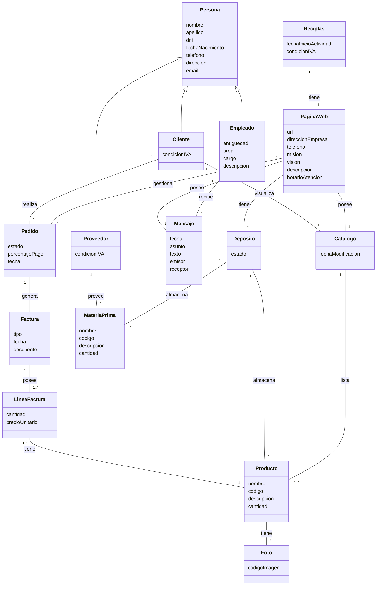

# Diagrama de Clases

Este diagrama de clases fue propuesto por los alumnos que realizaron el análisis.

```mermaid
classDiagram
    class Persona{
        nombre
        apellido
        dni
        fechaNacimiento
        telefono
        direccion
        email
    }
    class Proveedor{
        condicionIVA
    }
    class Empleado{
        antiguedad
        area
        cargo
        descripcion
    }
    class Cliente{
        condicionIVA
    }
    class Pedido{
        estado
        porcentajePago
        fecha
    }
    class Factura{
        tipo
        fecha
        descuento
    }
    class LineaFactura{
        cantidad
        precioUnitario
    }
    class Mensaje{
        fecha
        asunto
        texto
        emisor
        receptor
    }
    class Reciplas{
        fechaInicioActividad
        condicionIVA
    }
    class PaginaWeb{
        url
        direccionEmpresa
        telefono
        mision
        vision
        descripcion
        horarioAtencion
    }
    class Catalogo{
        fechaModificacion
    }
    class Producto{
        nombre
        codigo
        descripcion
        cantidad
    }
    class Foto{
        codigoImagen
    }
    class Deposito{
        estado
    }
    class MateriaPrima{
        nombre
        codigo
        descripcion
        cantidad
    }

    Persona <|-- Proveedor
    Persona <|-- Empleado
    Persona <|-- Cliente
    Proveedor "1" -- "*" MateriaPrima: provee
    Cliente "1" -- "1" Catalogo: visualiza
    Cliente "1" -- "*" Pedido: realiza
    Pedido "1" -- "1" Factura: genera
    Factura "1" -- "1..*" LineaFactura: posee
    LineaFactura "1..*" -- "1" Producto: tiene
    Producto "1" -- "*" Foto: tiene
    Deposito "1" -- "*" Producto: almacena
    Deposito "1" -- "*" MateriaPrima: almacena
    PaginaWeb "1" -- "*" Deposito: tiene
    PaginaWeb "1" -- "*" Pedido: gestiona
    PaginaWeb "1" -- "1" Mensaje: posee
    Empleado "1" -- "*" Mensaje: recibe
    PaginaWeb "1" -- "1" Catalogo: posee
    Catalogo "1" -- "1..*" Producto: lista
    Reciplas "1" -- "1" PaginaWeb: tiene
```
